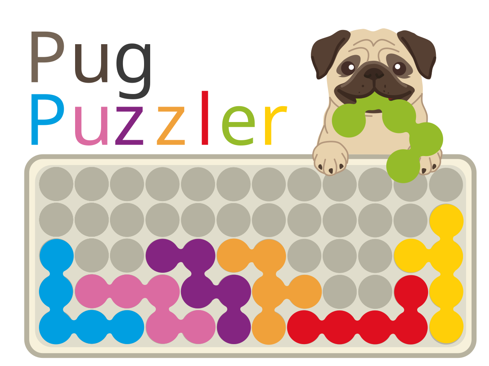

<p align="center">
  
</p>

# PugPuzzler

**PugPuzzler** (*Pretty Universal Geometry*) is a solver for packing puzzles: give it a board and a set of pieces, and it finds **every** way to fill the board, not just the first. It frames the puzzle as an exact cover problem and searches it in the spirit of Knuth's Algorithm X, with bitmasks instead of dancing links, compiled with numba.

It started as a way to answer questions about one particular game, and grew into a general tool:

- any set of pieces, with all rotations and mirror images
- flat boards of any shape, as well as 3D ones such as a pyramid
- block and board definitions are plain JSON, so a new game is a new folder, not new code
- complete solution counts for whole puzzle booklets in under a second
- bounds on how many solutions *any* puzzle on a board can have (see below)

## Why

As a kid I was obsessed with the **IQpuzzlerPRO** from SmartGames: a board, twelve pieces, and a booklet of puzzles that each start with a few pieces already in place. The goal is to fit in the rest. I don't think I ever finished a puzzle from the hardest difficulty, *wizard*.

A few years ago I tried to write a solver for it in Python with the limited knowledge I had then. It worked, but it was too slow to answer my questions, so I abandoned it. Recently I picked it up again and rewrote it from scratch, this time generalizing it to 3D puzzles and other variants.

## What it found

The tutorials run the solver on the puzzle booklets of **IQpuzzler** (the original) and **IQpuzzlerPRO** (the sequel, whose box promises exactly one solution per puzzle). A few of the results:

- Only 29 of the original's 72 booklet puzzles have a unique solution. Master puzzle 57 has 1,209.
- The empty IQpuzzler board has 371,020 solutions. From those, I could compute the exact minimum and maximum number of solutions a puzzle can have for every number of pre-filled cells. Two pieces are already enough to force a unique solution; the booklet never gives away fewer than 13 cells for one.
- IQpuzzlerPRO's promise holds on its flat boards (all 80 puzzles are unique). On the pyramid it holds for 39 of 40: **puzzle 120 has 5 solutions**, contrary to the box. The tests check every PRO puzzle against its printed booklet solution, entered by hand.

## Tutorials

The best way to see how it all works is to run the two notebooks in [tutorial/](tutorial/). Everything in them is computed when you run it.

1. [1_solver.ipynb](tutorial/1_solver.ipynb): the algorithm. How a game is represented, how packing becomes exact cover, and how the search works, with a puzzle small enough to follow node by node. Game-agnostic.
2. [2_findings.ipynb](tutorial/2_findings.ipynb): the applications. Solving the booklets, the bounds, the fewest pieces that make a unique puzzle, and checking IQpuzzlerPRO's promise.

For the code itself, [SOLVER_WALKTHROUGH.md](SOLVER_WALKTHROUGH.md) goes through the solver, and [SOLVER_NOTES.md](SOLVER_NOTES.md) has the measurements behind each design choice, including the ideas I tried and removed.

## Quick start

```
pip install -r requirements.txt
python run_tests.py
```

Solve a booklet puzzle and print its solutions:

```python
from constants import GAMES_DIR
from serialization import load_game
from solving import solve_puzzle, Verbosity

game = load_game(GAMES_DIR / "IQpuzzler")
solutions, stats = solve_puzzle(game.books["main_puzzles"]["50"], verbose=Verbosity.SHOW_SOLUTIONS)
```

A game lives in `games/<Game>/`: `blocks.json`, `boards.json`, and optional `books/` and `puzzles/` folders. `CLAUDE.md` has a full map of the codebase.

## On agentic coding, and the name

With the help of agentic coding, this task turned out to be far less daunting than it looked. As the project went on, I leaned more and more on LLMs for advice on architecture, cleaning up code and running tests. But unlike with my first attempt years ago, I could feel that I didn't have a full grasp of what the code was doing. I understood the individual parts, but the full picture was slipping away from me. Near the end of the project, I came across this video from 3Blue1Brown creator Grant Sanderson:

https://youtu.be/0Ge3jKLDJaA

It resonated with me. Before this project, I felt I had a deeper understanding of the code I produced, and now I found myself placing more trust in these agentic models. I was starting to identify more with the pug than the border collie. Hence the name: PugPuzzler.

To be clear, I still claim responsibility for this project and what it does. I have a good understanding of the code, although maybe not as deep as I could. But that was never the goal: I started this out of curiosity and passion, to answer some questions about a game I hold dear, and I think PugPuzzler succeeded at that.

This is a personal project, not a polished tool, and it isn't unique either. Many similar solvers exist, probably more efficient and more general (see polyformpuzzler, cemulate's polyomino-solver, and others).
